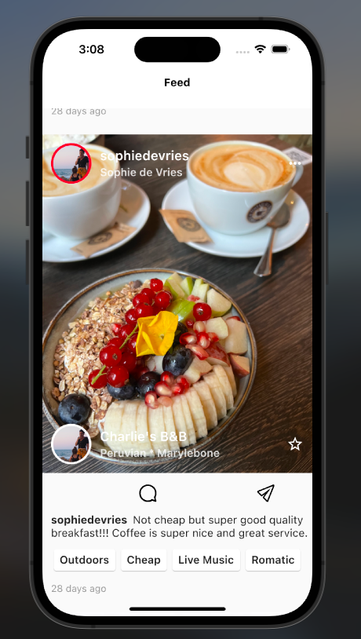

# spotlas

A new Flutter project.

This project does not support null safety. You will need to compile without sound null safety 
"flutter run --no-sound-null-safety" 
To run for ios platform, launch the ios simulator and type this command in the emulator "flutter run --no-sound-null-safety" 
To run for android platform , launch the android emulator and type this command in the emulator "flutter run --no-sound-null-safety"

## Getting Started

This project is a starting point for a Flutter application.

# How to use 

clone repo
https://github.com/Hafizalimi7/SpotlasApp.git

# ios
- open ios/Runner.xcworkspace
- cd ios
- pod install
- build on Xcode
- cd ..
- flutter run --no-sound-null-safety
- flutter run 

# Screenshots

A few resources to get you started if this is your first Flutter project:

- [Lab: Write your first Flutter app](https://docs.flutter.dev/get-started/codelab)
- [Cookbook: Useful Flutter samples](https://docs.flutter.dev/cookbook)

For help getting started with Flutter development, view the
[online documentation](https://docs.flutter.dev/), which offers tutorials,
samples, guidance on mobile development, and a full API reference.
